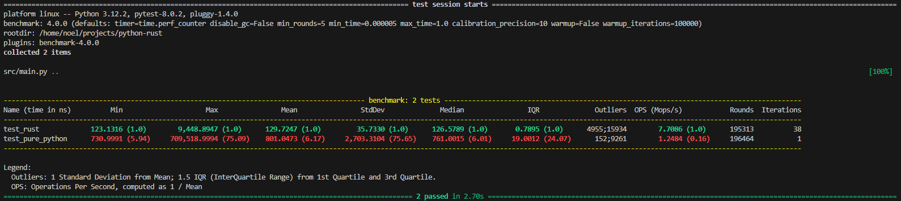

# RUST module for python

This was built using the guide from here:
https://mathspp.com/blog/write-a-python-module-in-rust

## Requirements

- Pyenv / virtual env
- rustc

## Installation

```
$ python -m venv .env
$ source .env/bin/activate
$ pip install -r requirements.txt
```

## Building & installing rust module

Note we need to build a release version or rust is similar speed to python

```
$ maturin build --release
$ pip install target/wheels/python_rust-0.1.0-cp312-cp312-manylinux_2_34_x86_64.whl 
```

## Running benchmarks

```
$ pytest src/main.py
```


## Developing

```
$ maturin build
```
